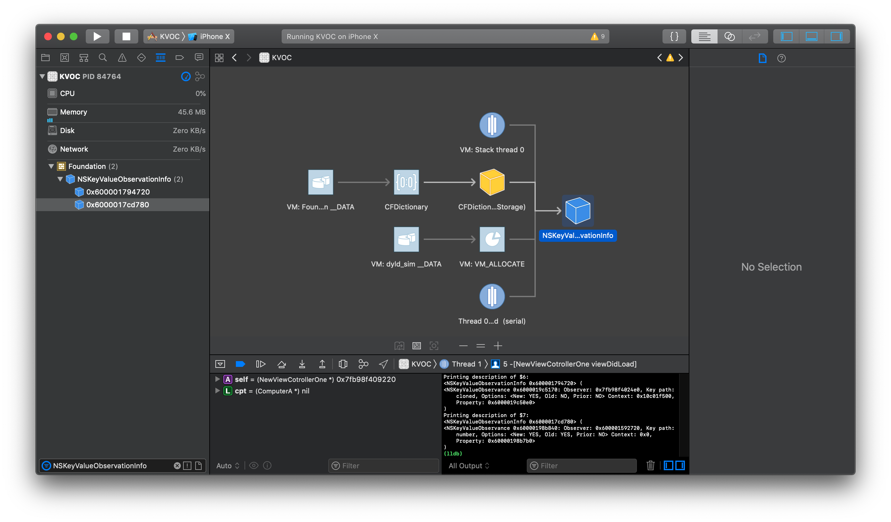
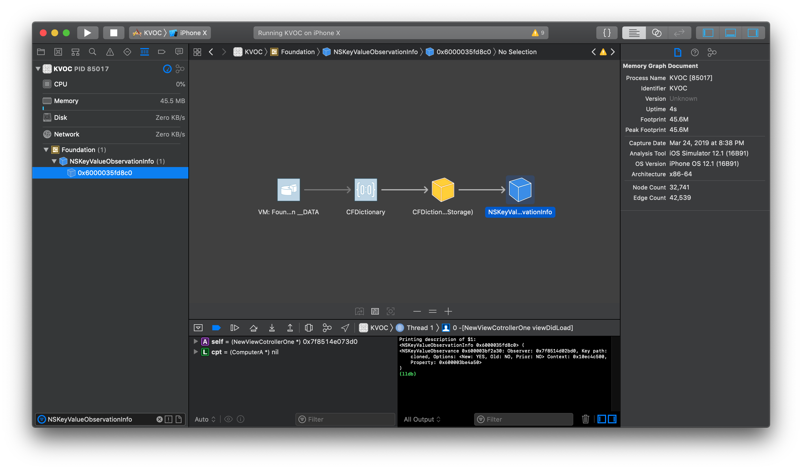

# Practice - iOS 中的 KVO 

| Date | Notes | iOS |
|:-----:|:-----:|:-----:|
| 2019-03-13 | 首次提交 | 12+ |

## Preface

KVO 即 Key-Value Observing，译作键值监听，通常用于监听对象的某个属性值的变化。也是设计模式中观察者模式的实践，下面将由浅入深，谈谈 iOS 中的 KVO。

## How

先来简单尝试下 KVO 的「魔力」吧。KVO 总共分为三个步骤，添加监听者、监听者得到通知、移除监听者。

在 `ViewController` 中，定义一个 `Computer` 类型的属性 `cpt`，并希望得知其中 `buttonClickTimes` 的每次变更。这时就可以将当前 `ViewController` 设置为 `cpt. buttonClickTimes` 的监听者；在按钮绑定的方法中，会对 `cpt.buttonClickTimes` 进行更新，所以当用户点击后，监听者就可以在 `observeValueForKeyPath:ofObject:change:context:` 中得知变更的通知；最后，在监听者销毁前，需要将其移除。

```objc
#import "ViewController.h"

@interface Computer : NSObject
@property (nonatomic, assign) int buttonClickTimes;
@end

@implementation Computer
@end


@interface ViewController ()
@property (nonatomic, strong) Computer *cpt;
@end

@implementation ViewController

- (Computer *)cpt {
    if (!_cpt) {
        _cpt = [[Computer alloc] init];
        // ➡️ 为 cpt 属性的键路径 buttonClickTimes 增加监听者 self（该控制器）
        // options 决定监听者将同时接收到新值和旧值
        // context 决定附带的上下文信息「ViewController-buttonClickTimes」。
        [_cpt addObserver:self
               forKeyPath:@"buttonClickTimes"
                  options:NSKeyValueObservingOptionNew | NSKeyValueObservingOptionOld
                  context:@"ViewController-buttonClickTimes"];
    }
    return _cpt;
}

- (void)dealloc {
    // ➡️ 在监听者销毁前将其移除
    [self.cpt removeObserver:self forKeyPath:@"buttonClickTimes"];
}

- (IBAction)clickOnButton:(id)sender {
    self.cpt.buttonClickTimes += 1;
}

- (void)observeValueForKeyPath:(NSString *)keyPath
                      ofObject:(id)object
                        change:(NSDictionary *)change
                       context:(void *)context {
    // ➡️ 根据 context 判定
    if (context == @"ViewController-buttonClickTimes") {
        NSLog(@"%@ - %@ - %@ - %@", change, keyPath, object, context);
    } else {
        [super observeValueForKeyPath:keyPath ofObject:object change:change context:context];
    }
}

@end
```

## What

```objc
// NSKeyValueObserving.h

@interface NSObject(NSKeyValueObserverRegistration)

- (void)addObserver:(NSObject *)observer forKeyPath:(NSString *)keyPath options:(NSKeyValueObservingOptions)options context:(nullable void *)context;
- (void)removeObserver:(NSObject *)observer forKeyPath:(NSString *)keyPath context:(nullable void *)context API_AVAILABLE(macos(10.7), ios(5.0), watchos(2.0), tvos(9.0));
- (void)removeObserver:(NSObject *)observer forKeyPath:(NSString *)keyPath;

@end
```

### 添加监听者

为属性添加监听者的 `addObserver:forKeyPath:options:context:` 方法中一共接收四个参数，下面来逐个分析一下。

#### observer

```objc
// NSKeyValueObserving.h

@interface NSObject(NSKeyValueObserving)

- (void)observeValueForKeyPath:(nullable NSString *)keyPath ofObject:(nullable id)object change:(nullable NSDictionary<NSKeyValueChangeKey, id> *)change context:(nullable void *)context;

@end
```

`observer` 即监听者，当监听值发生改变后，它的 `observeValueForKeyPath:ofObject:change:context:` 方法就会被调用。而由于该方法定义在 Obj-C 中 NSObject 的 `NSKeyValueObserving` 分类中，所以任何 NSObject 的子类可以通过实现该方法来成为监听者（但这并不代表可以实现 KVO）。

#### keyPath

`keyPath` 即键路径。如上我们要监听 `cpt` 的 `buttonClickTimes` 属性，那么其绝对键路径就是 `cpt.buttonClickTimes`。而这里的 `keyPath` 其实是相对于被监听者的相对键路径，所以 `buttonClickTimes` 即可。在单一键路径时，也可以使用 `NSStringFromSelector(@selector(buttonClickTimes))` 获取 getter 的方法名作为键路径，更加安全。

如果是嵌套多个对象，则使用多个 `.` 即可，比如下例中要监听 `cpt` 的 `screen. refreshedTimes` 可以拥有两种方式进行监听：

```objc
#import "ViewController.h"

@interface Screen : NSObject
@property (nonatomic, assign) int refreshedTimes;
@end

@implementation Screen
@end

@interface Computer : NSObject
@property (nonatomic, assign) int buttonClickTimes;
@property (nonatomic, strong) Screen *screen;
@end

@implementation Computer
@end

@interface ViewController ()
@property (nonatomic, strong) Computer *cpt;
@end

@implementation ViewController

- (Computer *)cpt {
    if (!_cpt) {
        _cpt = [[Computer alloc] init];
        _cpt.screen = [[Screen alloc] init];
        
        [_cpt addObserver:self
               forKeyPath:@"buttonClickTimes" // NSStringFromSelector(@selector(buttonClickTimes))
                  options:NSKeyValueObservingOptionNew | NSKeyValueObservingOptionOld
                  context:@"ViewController - buttonClickTimes"];
        // ➡️ 监听 cpt 的 screen.refreshedTimes
        [_cpt addObserver:self
               forKeyPath:@"screen.refreshedTimes"
                  options:NSKeyValueObservingOptionNew | NSKeyValueObservingOptionOld
                  context:@"ViewController - screen.refreshedTimes"];
        // ➡️ 也可以监听 cpt.screen 的 refreshedTimes 
        // [_cpt.screen addObserver:self
        //               forKeyPath:@"refreshedTimes"
        //                  options:NSKeyValueObservingOptionNew | NSKeyValueObservingOptionOld
        //                  context:@"ViewController - screen.refreshedTimes"];
    }
    return _cpt;
}

- (void)dealloc {
    [self.cpt removeObserver:self forKeyPath:@"buttonClickTimes"];
    [self.cpt removeObserver:self forKeyPath:@"screen.refreshedTimes"];
}

- (IBAction)clickOnButton:(id)sender {
    self.cpt.buttonClickTimes += 1;
    self.cpt.screen.refreshedTimes += 1;
}

- (void)observeValueForKeyPath:(NSString *)keyPath
                      ofObject:(id)object
                        change:(NSDictionary *)change
                       context:(void *)context {
    if (context == @"ViewController - buttonClickTimes") {
        NSLog(@"%@ - %@ - %@ - %@", change, keyPath, object, context);
    } else if (context == @"ViewController - screen.refreshedTimes") {
        NSLog(@"%@ - %@ - %@ - %@", change, keyPath, object, context);
    } else {
        [super observeValueForKeyPath:keyPath ofObject:object change:change context:context];
    }
}

@end
```

需要注意的是，当 `keyPath` 为空时，编译器会警告「Null passed to a callee that requires a non-null argument」，此时监听是无意义的；当需要监听本类中无需嵌套的属性时，为 `self` 添加监听即可，若将 `keyPath` 设置为 `@""` 也是无效的。

#### options

`options` 即配置选项，其类型为 `NSKeyValueObservingOptions` 枚举，用来确定监听通知的内容和发送时机，其一共有四个枚举值，但可以通过 `|` 按位或运算符进行组合。

```objc
// NSKeyValueObserving.h
typedef NS_OPTIONS(NSUInteger, NSKeyValueObservingOptions) {
    NSKeyValueObservingOptionNew = 0x01,
    NSKeyValueObservingOptionOld = 0x02,
    NSKeyValueObservingOptionInitial API_AVAILABLE(macos(10.5), ios(2.0), watchos(2.0), tvos(9.0)) = 0x04,
    NSKeyValueObservingOptionPrior API_AVAILABLE(macos(10.5), ios(2.0), watchos(2.0), tvos(9.0)) = 0x08
};
```

在四个枚举值中，`NSKeyValueObservingOptionNew` 和 `NSKeyValueObservingOptionOld` 选项决定了监听者接收改变前的值和改变后的值，使用 `NSKeyValueChangeNewKey` 和 `NSKeyValueChangeOldKey` 即可取得 `change` 中对应的值：

```objc
- (void)observeValueForKeyPath:(NSString *)keyPath
                      ofObject:(id)object
                        change:(NSDictionary *)change
                       context:(void *)context {
    if (context == @"ViewController - buttonClickTimes") {
        NSLog(@"New: %@, old: %@ - %@ - %@ - %@", change[NSKeyValueChangeNewKey], change[NSKeyValueChangeOldKey], keyPath, object, context);
    } else if (context == @"ViewController - screen.refreshedTimes") {
        NSLog(@"New: %@, old: %@ - %@ - %@ - %@", change[NSKeyValueChangeNewKey], change[NSKeyValueChangeOldKey], keyPath, object, context);
    } else {
        [super observeValueForKeyPath:keyPath ofObject:object change:change context:context];
    }
}

// OUTPUT:
// New: 1, old: 0 - buttonClickTimes - <Computer: 0x600001a1c3e0> - ViewController - buttonClickTimes
// New: 1, old: 0 - refreshedTimes - <Screen: 0x600001844680> - ViewController - screen.refreshedTimes
```

`NSKeyValueObservingOptionInitial` 选项可以当添加监听者后立刻收到仅且一次的通知。

```objc
[_cpt addObserver:self
       forKeyPath:NSStringFromSelector(@selector(buttonClickTimes))
          options:NSKeyValueObservingOptionNew | NSKeyValueObservingOptionOld | NSKeyValueObservingOptionInitial
          context:@"ViewController - buttonClickTimes"];

// ➡️ 首次触发是由于添加了监听者而无需改变值，NSKeyValueObservingOptionInitial 会立刻触发
// 注意如果加了 NSKeyValueObservingOptionNew | NSKeyValueObservingOptionOld 选项，则新值为添加时属性的值，旧值为空
// New: 0, old: (null) - buttonClickTimes - <Computer: 0x6000016464c0> - ViewController - buttonClickTimes
// ➡️ buttonClickTimes 增加，监听者接收到通知
// New: 1, old: 0 - buttonClickTimes - <Computer: 0x6000016464c0> - ViewController - buttonClickTimes
```

`NSKeyValueObservingOptionPrior` 选项可以在属性改变前，还未得到新值时收到通知。我们可以在 `change` 中 `NSKeyValueChangeNotificationIsPriorKey` 对应值里检查是否来自该选项触发。

```objc
[_cpt addObserver:self
       forKeyPath:NSStringFromSelector(@selector(buttonClickTimes))
          options:NSKeyValueObservingOptionNew | NSKeyValueObservingOptionOld | NSKeyValueObservingOptionInitial | NSKeyValueObservingOptionPrior
          context:@"ViewController - buttonClickTimes"];

// NSLog(@"New: %@, old: %@ - isPrior %@ - %@ - %@ - %@", change[NSKeyValueChangeNewKey], change[NSKeyValueChangeOldKey], change[NSKeyValueChangeNotificationIsPriorKey], keyPath, object, context);

// ➡️ NSKeyValueObservingOptionInitial：一旦添加监听者，立即触发
// New: 0, old: (null) - isPrior (null) - buttonClickTimes - <Computer: 0x60000168dd00> - ViewController - buttonClickTimes
// ➡️ NSKeyValueObservingOptionPrior：属性改变前触发
// New: (null), old: 0 - isPrior 1 - buttonClickTimes - <Computer: 0x60000168dd00> - ViewController - buttonClickTimes
// ➡️ 属性已更新为新值
// New: 1, old: 0 - isPrior (null) - buttonClickTimes - <Computer: 0x60000168dd00> - ViewController - buttonClickTimes
```

#### context

`context` 即上下文。上下文是一个在阅读中常用的词，指文章的上文与下文，编程中常用的上下文也与此类似，泛指环境条件等信息。关于此处的 `context`，主要意义是来区分不同的监听通知，在后续也可以根据 `context` 移除指定的通知。关于 `context` 的最佳实践，首先要做到唯一且私有，唯一是为了区分不同的监听通知，而私有代表其不能被外界知晓甚至随意更改。比较好的实践是将 `context` 定义为静态全局变量，只可在定义该变量的源文件（.m）中有效，防止子类或其他源文件使用，做到私有；进而将 `context` 赋值为指向其本身内存地址，做到唯一。`context` 在参数中的类型为 `void *`，则将地址转换为该类型；为了防止在同一源文件中对该变量的更改，将其声明为 `const` 保证了其本身为常量，不可更改。

```objc
static void * const kButtonClickTimesKVOContext = (void *)&kButtonClickTimesKVOContext;

if (context == kButtonClickTimesKVOContext) {
    NSLog(@"New: %@, old: %@ - isPrior %@ - %@ - %@", change[NSKeyValueChangeNewKey], change[NSKeyValueChangeOldKey], change[NSKeyValueChangeNotificationIsPriorKey], keyPath, object);
}
```

需要注意的是，`addObserver` 方法中并不会对监听者、被监听者、以及上下文进行强引用，需要我们自己来保证不会被释放。

### 监听者得到通知

```objc
@interface NSObject(NSKeyValueObserving)

- (void)observeValueForKeyPath:(nullable NSString *)keyPath ofObject:(nullable id)object change:(nullable NSDictionary<NSKeyValueChangeKey, id> *)change context:(nullable void *)context;

@end
```

监听者要实现 `NSKeyValueObserving` 分类中的 `observeValueForKeyPath:ofObject:change:context:` 方法来接收被监听对象改变的通知，其中大部分参数与添加监听者中的一致。如果监听者不实现该方法，将在运行时发生崩溃：

```objc
// *** Terminating app due to uncaught exception 'NSInternalInconsistencyException', reason: '<ViewCotroller: 0x7f859a4093e0>: An -observeValueForKeyPath:ofObject:change:context: message was received but not handled.
```

#### change

```objc
typedef NSString * NSKeyValueChangeKey NS_STRING_ENUM;

FOUNDATION_EXPORT NSKeyValueChangeKey const NSKeyValueChangeKindKey;
FOUNDATION_EXPORT NSKeyValueChangeKey const NSKeyValueChangeNewKey;
FOUNDATION_EXPORT NSKeyValueChangeKey const NSKeyValueChangeOldKey;
FOUNDATION_EXPORT NSKeyValueChangeKey const NSKeyValueChangeIndexesKey;
FOUNDATION_EXPORT NSKeyValueChangeKey const NSKeyValueChangeNotificationIsPriorKey API_AVAILABLE(macos(10.5), ios(2.0), watchos(2.0), tvos(9.0));
```

`NSKeyValueChangeKindKey` 指变更的类型，又有以下四个枚举。当被监听的对象为非集合类型时，总是为 `NSKeyValueChangeSetting`；当为集合类型时，插入、删除、替换操作分别对应其余的几个枚举。

```objc
typedef NS_ENUM(NSUInteger, NSKeyValueChange) {
    NSKeyValueChangeSetting = 1,
    NSKeyValueChangeInsertion = 2,
    NSKeyValueChangeRemoval = 3,
    NSKeyValueChangeReplacement = 4,
};
```

`NSKeyValueChangeIndexesKey` 指变更的索引，类型为 `NSIndexSet`，仅当被监听对象为集合类型时，对应变更的索引集合。

### 移除监听者

当不再需要监听或当监听者销毁前，需要先移除监听者。前者比较容易理解，但为什么监听者销毁前也需要移除呢？我在 StackOverflow 上找到一个类似的问题，高赞回答的作者表示在 Symbolic Exception 中设定 `NSKVODeallocateBreak` 即可捕获其异常，但在我的尝试中并不能捕获到；他又提到不能被销毁的不是监听者也不是被监听者，而是实现 KVO 运行时自动创建的 `NSKeyValueObservationInfo` 对象不能被销毁，我尝试使用 Debug Memory Graph，但也没找到和手动移除的区别。我也在 Draveness 的博客上找到与 KVO 相关的文章，但其中 Crash 的例子也没有再次复现。KVO 的内部实现难道更新了吗？于是对于这个问题，我也在 StackOverflow 上重新进行了提问。

KVO 给开发者带来个很强的自由性，但移除监听者中却有不少「坑」在这里的。

#### 监听者销毁前移除监听者

```objc
Computer *cpt = [[Computer alloc] init];
[self addObserver:cpt forKeyPath:@"number" options:NSKeyValueObservingOptionNew | NSKeyValueObservingOptionOld context:nil];
// [self removeObserver:cpt forKeyPath:@"number"];
cpt = nil;
self.number += 1;

// Crash: Thread 1: EXC_BAD_ACCESS
```

我们尝试下在监听者销毁后，对被监听者的值做出改变。这时程序将崩溃，为野指针错误。这说明在系统得知被监听者改变后，尝试去寻找监听者，但此时监听者已经被销毁，其保存的内存地址已经不再是监听者了，所以发生此错误。为了比较移除监听者的作用，首先我们在未移除的代码中 `self.number += 1;` 一行打个断点，查看 Debug Memory Graph：



其中有两个 `NSKeyValueObservationInfo` 对象，尝试将它们打印出来：

```objc
// LLDB:
// Printing description of $6:
// <NSKeyValueObservationInfo 0x600001794720> (
// <NSKeyValueObservance 0x6000019c5170: Observer: 0x7fb98f4024e0, Key path: cloned, Options: <New: YES, Old: NO, Prior: NO> Context: 0x10c01f500, Property: 0x6000019c50e0>
// )
// Printing description of $7:
// <NSKeyValueObservationInfo 0x6000017cd780> (
// <NSKeyValueObservance 0x60000198b840: Observer: 0x600001592720, Key path: number, Options: <New: YES, Old: YES, Prior: NO> Context: 0x0, Property: 0x60000198b7b0>
// )
```

第一个 KVO 应该是系统在底层加入的，监听者是 `0x7fb98f4024e0`，查一下发现是 `UIScreen`，这里略过。


第二 KVO 就是我们加入的对 `number` 的监听。由于我们没有手动移除监听者，虽然监听者已经销毁，但监听关系仍然存在。所以当我们继续执行，程序将发生崩溃。

而如果令监听者在销毁前移除监听，那么 Debug Memory Graph 会是这样：



即移除了之前我们加入的监听者，所以当我们继续执行，程序将不会发生崩溃。

#### 被监听者销毁前移除监听者

由于 Apple 并没有将 KVO 开源，对于「移除监听者」我查阅了不少资料，并进行了实践。似乎在之前的系统版本中（具体不明），当未在被监听者销毁前移除监听者时，程序也将发生崩溃。但在最新的系统中，相同的测试代码却未发生崩溃。且在 Debug Memory Graph 可以看出，即使没有移除监听者，`NSKeyValueObservationInfo` 却也在被监听者销毁后销毁了。

对于此，我也在 StackOverflow 中进行了提问，希望有明白这里细节的同学多多指点。如果有了答案，我在这里也将会进行补充。

#### context

```objc
// 添加两次 KVO
[_cpt addObserver:self
       forKeyPath:NSStringFromSelector(@selector(buttonClickTimes))
          options:NSKeyValueObservingOptionNew
          context:kButtonClickTimesKVOContext1];
[_cpt addObserver:self
       forKeyPath:NSStringFromSelector(@selector(buttonClickTimes))
          options:NSKeyValueObservingOptionNew
          context:kButtonClickTimesKVOContext2];
          
- (IBAction)click:(id)sender {
    NSLog(@"---");
    // 移除一次
    [self.cpt removeObserver:self forKeyPath:NSStringFromSelector(@selector(buttonClickTimes))];
}

// kButtonClickTimesKVOContext2
// kButtonClickTimesKVOContext1
// ---
// kButtonClickTimesKVOContext1
// ---
```

`context` 是 `removeObserver:forKeyPath:context:` 的参数，与添加监听者类似，用作区分通知。当我们尝试添加两次 KVO，并在点击方法中移除而不指定 `context`，监听者收到通知会打印相应的 `context` 名。从输出可以看出 `removeObserver:forKeyPath:` 并没有移除所有的监听者。根据官方的注释：建议使用 `removeObserver:forKeyPath:context:` 取代 `removeObserver:forKeyPath:`，因为后者并未指定 `context` 将会自动猜测 `context` 指针，从而可能导致意想不到的错误。

#### 非被监听者移除监听者

```objc
// 'NSRangeException', reason: 'Cannot remove an observer <ViewController 0x7fa953c18bd0> for the key path "buttonClickTimes" from <Computer 0x6000007731e0> because it is not registered as an observer.'
```

当我们在被监听者上移除监听者，被监听者将自动恢复为非被监听者，但当此时再次尝试移除监听者时，程序将发生崩溃。所以建议和 `try/catch` 一同使用，防止多次移除引起崩溃。

```objc
@try {
    [self.cpt removeObserver:self forKeyPath:@"buttonClickTimes"];
} @catch (NSException *exception) {
    NSLog(@"%@", [exception description]);
}

// OUTPUT:
// Cannot remove an observer <ViewController 0x7f9b60d012a0> for the key path "buttonClickTimes" from <Computer 0x600002975960> because it is not registered as an observer.
```

## Why


## Reference

- [Key-Value Observing Programming Guide - Apple Inc.](https://developer.apple.com/library/archive/documentation/Cocoa/Conceptual/KeyValueObserving/KeyValueObserving.html)
- [Best practices for context parameter in addObserver (KVO) - StackOverflow](https://stackoverflow.com/questions/12719864/best-practices-for-context-parameter-in-addobserver-kvo)
- [Do I have to removeObserver in KVO manually - StackOverflow](https://stackoverflow.com/questions/19514450/do-i-have-to-removeobserver-in-kvo-manually)
- [如何优雅地使用 KVO - Draveness](https://draveness.me/kvocontroller)