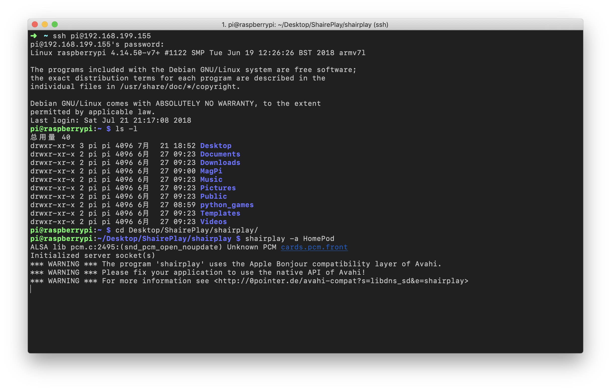
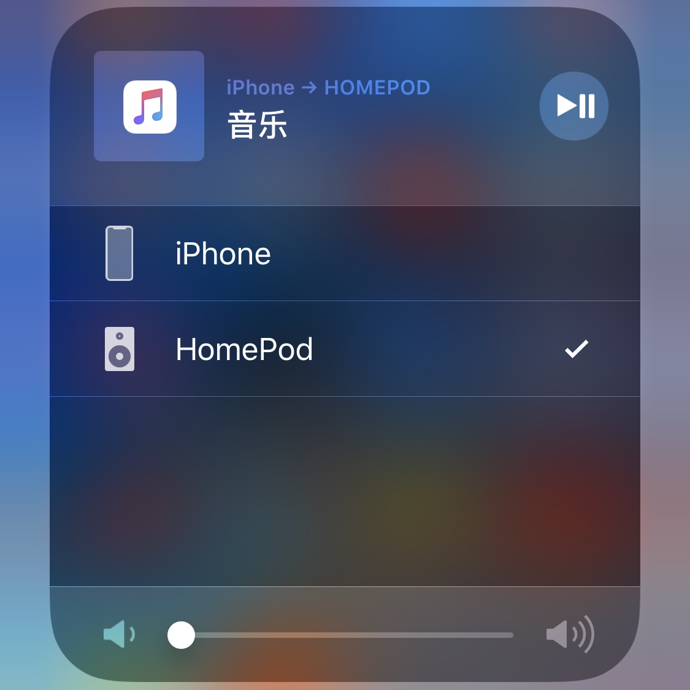

# Tips - 将树莓派作为 AirPlay 音频服务器

| Raspberry Pi | Platform | juhovh/shairplay |
|:-----:|:-----:|:-----:|
| 3 B | Raspbian 4.14 | 765148f98f343b3b9911cc05504ac276cfc44c26 |

## Info

树莓派是个很容易吃灰的设备，配置太低，又弃之可惜。何不作为 AirPlay 来解放你的有线音箱呢？

## Solution

> SSH 或直接在树莓派的终端中运行以下命令，关于 SSH、VNC、替换源等操作请自行搜索。

### Basic setup

- 安装依赖

```
sudo apt-get install autoconf automake libtool
sudo apt-get install libltdl-dev libao-dev libavahi-compat-libdnssd-dev
sudo apt-get install avahi-daemon
```

- 编译安装

```
cd ~/Desktop
mkdir AirPlay
cd AirPlay

git clone https://github.com/juhovh/shairplay.git
cd shairplay

./autogen.sh
./configure
make
sudo make install
```

- 启动
    - `-a` 后的参数 为 AirPlay 的名称，可自定义，eg. `HomePod`
    - 注意该命令必须在下载源码的路径中运行

```
shairplay -a HomePod
```

- 至此，即可在同一局域网环境下的 Apple 设备中发现该 AirPlay 音箱，但如果终端窗口关闭，则会终止运行



### 后台运行

- 安装 Supervisor（可参考前文）
- 配置
    - 注意第一个 `command` 需要切换到 ShairPlay 源代码的路径

```ini
; shareplay.ini
[program:shairplay]
command=cd /home/pi/Desktop/ShairPlay/shairplay
command=shairplay -a HomePod
autostart=true
autorestart=true
startretries=5
user=pi

[supervisord]
```

- 在 supervisor.conf 中包含上述配置文件即可

```conf
[include]
files=shairplay.ini

[supervisorctl]
```

- 运行 Supervisor

```
# superviord -c ${SUPERVISOR_CONFIG_PATH}
sudo supervisord -c /etc/supervisor/conf.d/supervisord.conf
```

- Enjoy it!



## Reference

- [juhovh/shairplay](https://github.com/juhovh/shairplay)
- [Supervisor 的安装与基本使用](https://github.com/kingcos/Perspective/issues/9)

## Extension

- 开机自启动 & 噪音消除
    - [跟着上手树莓派（三）—— 让你的有线音箱从此无拘无束](https://sspai.com/post/39839)
- [moOde audio player](http://www.moodeaudio.org)
